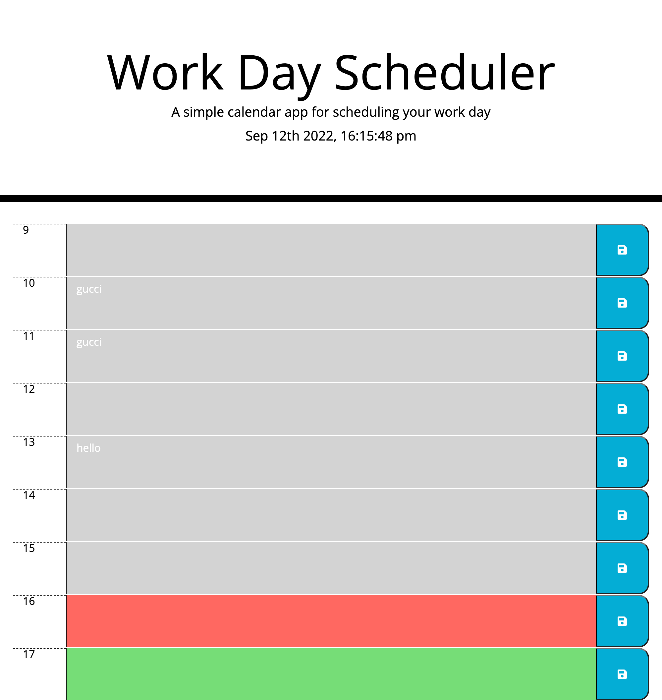

<!-- PROJECT LOGO -->
 

  

  <h3 align="center">Hustler's Work Day Scheduler</h3>

  

    The best and only planner a hard worker will EVER need(if you only work 9-5...). Not only can you write AND save all the important things you need to do during the WHOLE day(9-5) but this magical planner even lets you know the time down to the nearest hour! WOW!
     

<!-- ABOUT THE PROJECT -->
## About The Project

In this project I combined my extensive(a little bit limited actually) knowledge of CSS, HTML and Javascript to make a super effective and still simple to use workday planner to help people remember all the things they need to get during the day.

(<a href="#readme-top">back to top</a>)

### Built With

This page was built with HTML, CSS and Javasript.

### Prerequisites

No prerequisites required.

### Installation

This page requires no installation of any kind simply click on the link, type out things you need to do during the day, hit save and they will be forever saved(unless you clear the consol).

(<a href="#readme-top">back to top</a>)

<!-- USAGE EXAMPLES -->
## Usage
This page is amazing for forget people that need a little extra help remembering things.

(<a href="#readme-top">back to top</a>)

<!-- CONTRIBUTING -->
## Contributing

I am the only direct(instructors and tutor helped) contributer to this Repo.

(<a href="#readme-top">back to top</a>)

<!-- LICENSE -->
## License

MIT 

(<a href="#readme-top">back to top</a>)

<!-- CONTACT -->
## Contact

Fabian Gutierrez - [fabiangutierrez580@gmail.com]
(LinkedIn) - [www.linkedin.com/in/fabian-gutierrez-016523248]

Project Link: [https://guccierrez.github.io/WorkdayPlanner/]

<!-- ACKNOWLEDGMENTS -->
## Acknowledgments
Again shout out to My instructors, Mr. Edwards and Mr. Andrew. This week I'd also like to thank my tutor Mr. Andres Jimenez.

<!-- MARKDOWN LINKS & IMAGES -->
